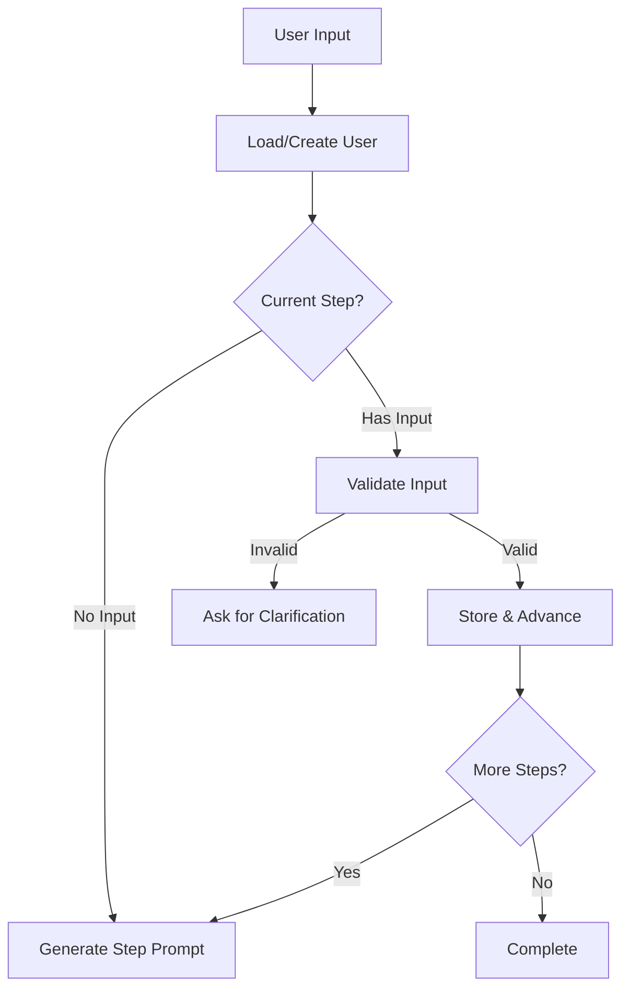

# AI-Powered Onboarding Flow
This demo showcases an intelligent conversation flow for user onboarding, using OpenAI's GPT models to provide natural language processing and validation.


### How It Works
#### 1. Conversation Flow Architecture


####  2. Step Progression
The onboarding process collects the following in this shown order:

- First Name
- Last Name Collection
- Company Information
- Job Function
- Job Title
- Referral Source

Each step includes:
- Main prompt for the user
- System context for AI
- Validation rules
- Field mapping in database

####  3. AI Integration
The system uses two types of AI interactions per step:

- Input validation: Ensures provided information matches expected format
- Response generation: Creates contextual, natural-language responses


#### Tech Stack

- API Framework: Flask (using factory pattern)
- Database: PostgreSQL
- ORM: SQLAlchemy
- LLM: OpenAI GPT-4

### Quick Start
#### Installation
1. Clone the repository:

``` bash
git clone https://github.com/yourusername/onboarding.git
cd onboarding
``` 
2. Create and activate virtual environment:

``` bash
python -m venv venv
source venv/bin/activate  # On Windows, use: venv\Scripts\activate
``` 
3. Install dependencies:
```bash
pip install -r requirements.txt
```

4. Create a .env file in the project root:

``` bash
FLASK_ENV=development
SECRET_KEY=<your-secret-key>
DATABASE_URL=postgresql://<user>:<password>@localhost:5432/<database>
OPENAI_API_KEY=<your-openai-api-key>
OPENAI_MODEL_NAME=gpt-4
```
5. Initialize the database:
``` bash
flask db init
flask db upgrade
```


#### Project Structure
```
onboarding/
├── app/
│   ├── __init__.py           # App factory
│   ├── routes.py             # API endpoints + utility functions
│   ├── models.py             # SQLAlchemy models
│   └── config.py             # Configuration
├── migrations/               # Database migrations
├── tests/                    # Test files
├── .env                      # Environment variables
├── requirements.txt          # Dependencies
└── wsgi.py                  # Application entry point
```

**Note:** For demo purposes, utility functions and helper classes are defined in routes.py. In a production environment, these should be properly organized into separate modules.


### Running the Application

**Activate virtual environment:**

Mac/Linux

```
source venv/bin/activate  # 
```
Windows: 
``` 
venv\Scripts\activate
```
**Start the Flask server:**
```
flask run -p 8000 --debug
```

### API Endpoints
#### User Management
**GET /api/user/uuid:user_id**

Retrieve a specific user's information
```
curl http://localhost:5000/api/user/123e4567-e89b-12d3-a456-426614174000
```
  
**GET /api/user**

List all users
```
curl http://localhost:5000/api/user
```
**PUT /api/user/uuid:user_id**

Update user information
```
curl -X PUT http://localhost:5000/api/user/123e4567-e89b-12d3-a456-426614174000 \
     -H "Content-Type: application/json" \
     -d '{"first_name": "John", "last_name": "Doe"}'
```
**POST /api/user**

Create a new user
```
curl -X POST http://localhost:5000/api/user \
     -H "Content-Type: application/json" \
     -d '{}'
```

#### Onboarding Flow
**POST /api/onboarding**

 Handle onboarding conversation
```
curl -X POST http://localhost:5000/api/onboarding \
     -H "Content-Type: application/json" \
     -d '{"user_id": "123e4567-e89b-12d3-a456-426614174000", "input": "John"}'
```

### Known Limitations & TODOs
- Implement proper authentication
- Add request validation
- Implement rate limiting
- Organize utility functions
- Add comprehensive error handling
- Add logging
- Add tests